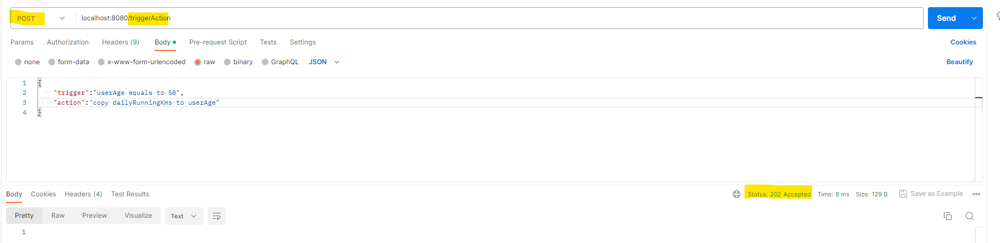
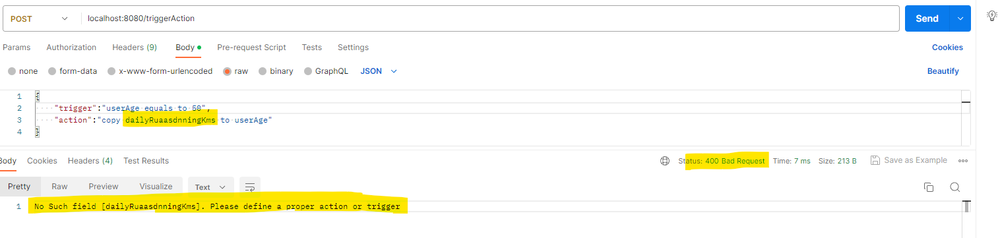
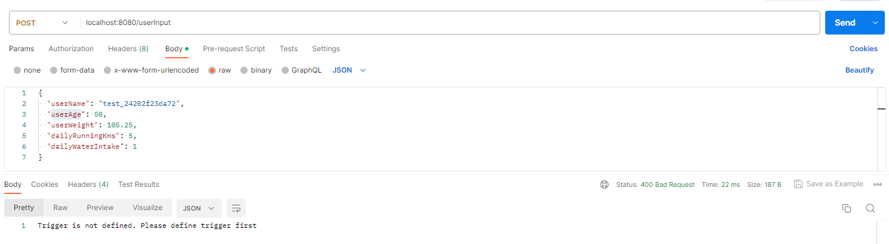
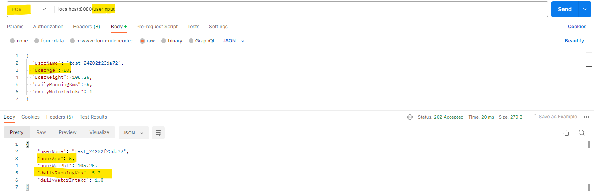

# User Trigger and Action
## Introduction
This application lets the used to define a trigger and action. Trigger is a condition on several variables, if the condition is true for input that user provides then it should perform the action. Action will be to copy the value of one variable to another.

### Steps to Run
1. Clone this repository into ur local and build it using  ```gradle build```.
2. Run the application using 	```gradle bootRun``` command.
3.  The application will start to run in ```8080``` port.  If this port is busy then add ```server.port=8081``` to the application.properties file *(use 8081 or any other port that's available)*.
4. Once the program has started, you can open the postman to send requests.

#### Below are the Screenshots for example:
*Setting up trigger and Action*


*Setting up trigger with invalid details*


*Setting up action with invalid details*


*If the user tris to save the input before setting up trigger*


> Once the Trigger and action are defined, we can move to setting up user input for variables.

*The response here has **userAge** and **dailyRunningKms** as same because of the action that performed since the trigger condition has been met.*



